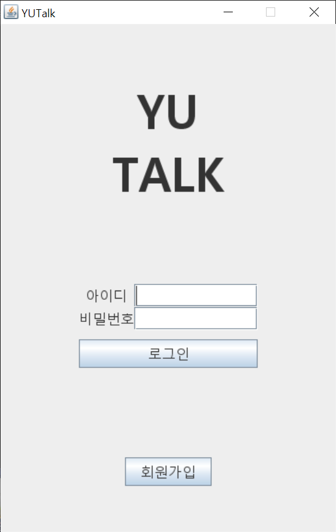

# YUTalk



자바로 Thread와 Socket 통신을 사용하여 구현한 채팅 클라이언트입니다.

## Getting Started / 어떻게 시작하나요?

YUTalk_Server를 먼저 실행 후 Intellij로 프로젝트를 열고 프로젝트를 빌드하여 실행하시면 됩니다.

### Prerequisites / 선행 조건

아래 사항들이 설치가 되어있어야합니다.

```
JDK 1.8 이상, Intellij, YUTalk_Server
```
+ [YUTalk_Server](https://github.com/psh3253/yutalk_server)

## Built With / 누구랑 만들었나요?

* [박세훈](https://github.com/psh3253) - 프로젝트 전체 설계 및 제작

## Function / 기능
+ 로그인
+ 회원가입
+ 상태 메시지 변경
+ 친구 추가
+ 개인 채팅
+ 단체 채팅
+ 채팅방 생성
+ 채팅방 친구 초대
+ 채팅방 퇴장
+ 메시지 전송
+ 대화상대 보기

## Technology / 기술

+ Thread를 사용하여 서버로 주기적으로 정보 갱신 요청
+ Socket 통신을 사용하여 서버와 데이터 교환
+ Swing을 사용하여 GUI 구현

## License / 라이센스

이 프로젝트는 GPL-3.0 라이센스로 라이센스가 부여되어 있습니다. 자세한 내용은 LICENSE 파일을 참고하세요.
